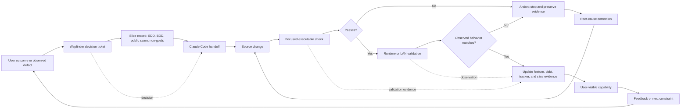
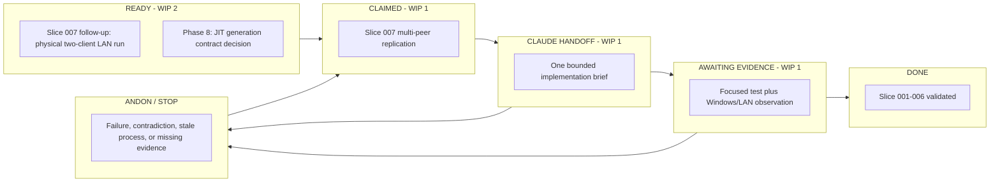
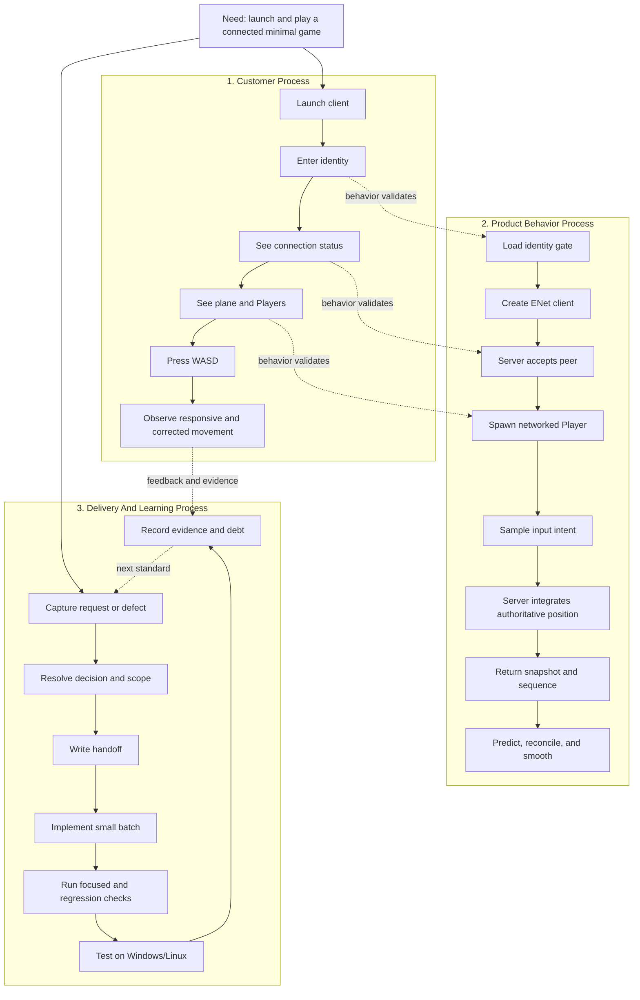
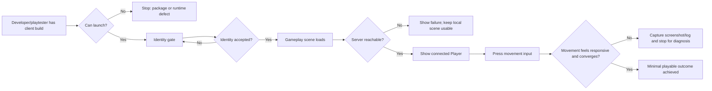
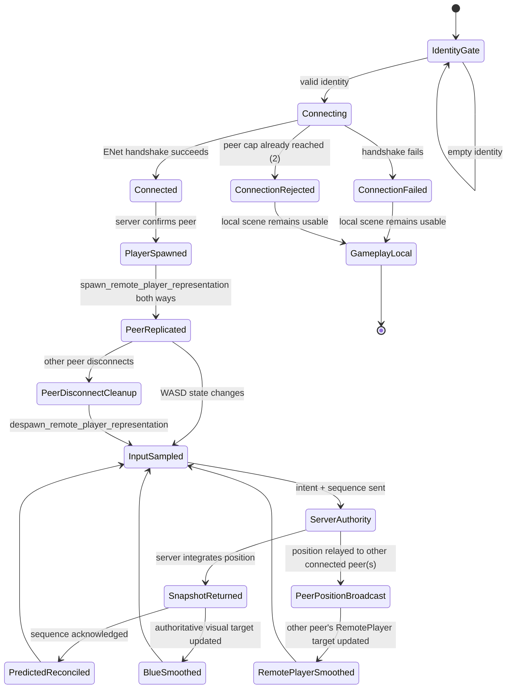
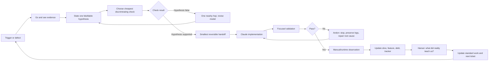
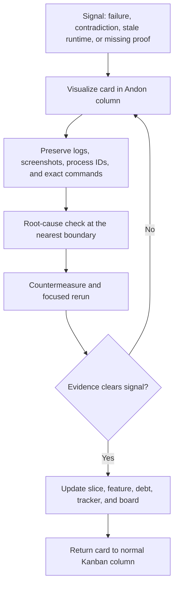

# Project0 Process Maps

These maps make the TPSA flow visible for the current Project0 value stream.
They are living delivery artifacts: update them when a new phase changes the
customer journey, runtime behavior, or delivery loop.

## Scope

The current value stream is:

> A developer or playtester launches the Windows client, connects to the Linux
> server, enters a local identity, and moves a Player while the server remains
> authoritative for networked movement. Up to two clients (Slice 007) can be
> connected at once, each seeing the other's server-authoritative movement and
> a clean removal of the other's representation on disconnect.

The maps stop before JIT world generation, SQLite canon persistence,
production authentication, and support for more than two concurrent peers,
because those systems are not yet in the live path.

## Material And Information Flow

This is the MIFC for one bounded implementation slice. The material flow is
the changing product state and runtime artifact. The information flow is the
decision, handoff, evidence, and feedback that tells the next step what to do.

### Flow units and queues

| Flow unit | Information carried | Value-added step | Queue or stop signal |
| --- | --- | --- | --- |
| User outcome | Desired behavior, screenshot, or failure text | Clarify the smallest observable outcome | Ambiguous scope stops at Wayfinder/grilling |
| Decision ticket | One answerable design question | Resolve one decision | Blocked ticket remains unclaimed or blocked |
| Handoff brief | Scope, public seam, invariants, validation | Give Claude one bounded implementation unit | Missing acceptance evidence stops handoff |
| Source change | Client/server/docs artifact | Implement the decision | Unrelated file changes trigger review |
| Validation result | Exit code, logs, observed state, machine-readable result artifact | Prove behavior at the public seam and preserve trend evidence | Any failure or missing artifact pulls the Andon cord |
| Runtime observation | Windows/LAN behavior and user feedback | Confirm the real customer path | Contradiction reopens diagnosis |
| Delivery record | Feature, debt, phase, and evidence status | Preserve organizational learning | Stale records are a process defect |

## Kanban Board

This is the delivery board for the current value stream. The board is
intentionally small-lot: one active implementation handoff at a time. A card
may move right only when the exit evidence for its current column exists.

### Current board

| Card | Column | Exit condition for next move | Evidence or stop reason |
| --- | --- | --- | --- |
| Slice 001: identity, plane, local movement | Done | None; regression only | Headless smoke test passes; Windows rendering confirmed during client work |
| Slice 002: server connection proof | Done | None; regression only | ENet connection and Player spawn smoke test pass |
| Slice 003: LAN client connection | Done with follow-up | Physical LAN behavior remains a reusable regression check | User connected Windows client to Linux server |
| Slice 004: authoritative movement | Done with follow-up | Multi-peer behavior must preserve authority | Server-owned movement smoke test passes |
| Slice 005: prediction/reconciliation | Done with follow-up | Multi-peer behavior must preserve sequence acknowledgement | Prediction smoke test passes; visual quality remains a manual check |
| Slice 006: portable Windows client | Done | None for this slice; release hardening is separate | Exported client launched outside editor/source share and connected over LAN |
| Slice 007: multi-peer replication | Evidence / handoff review | Two-client Windows/LAN run and final review | Headless multi-peer evidence exists; physical two-client run remains open |
| JIT world generation | Ready / fog | Slice 007 review and authority model must settle first | Not eligible for implementation yet |

### Kanban operating rules

- `Ready`: decision is clear, ticket is unclaimed, and acceptance evidence is
  known.
- `Claimed`: one agent owns the ticket; no second implementation handoff may
  start for the same slice.
- `Claude Handoff`: exactly one bounded implementation request is active.
- `Awaiting Evidence`: code is present, but executable or real-client proof is
  still required; no new feature scope enters this column.
- `Done`: the public seam, focused validation, relevant regression checks, and
  user-visible evidence are recorded in the slice and delivery records.
- `Andon / Stop`: work pauses immediately on failure, stale runtime code,
  contradictory tracker state, or missing evidence. The card returns only
  after the root cause and countermeasure are recorded.

WIP limits are deliberate: one active Claude implementation handoff and one
slice awaiting evidence. If either limit is exceeded, stop pulling new work.

## Three Concurrent Processes

These lanes run concurrently. They are related, but they must not be mixed:
the player journey is not a server implementation detail, and a test result is
not proof of a user-visible rendering outcome.

## Customer Process Map

Primary customer measures:

- Time from launching the client to seeing the connected gameplay scene.
- Time from pressing movement input to seeing a visible response.

Guardrails:

- Connection failure is visible and does not silently appear successful.
- A stale or incompatible server is surfaced by the connection/RPC error path.
- No client input is allowed to become authoritative position directly.
- The client package must not include server-only files or credentials.

## Product Behavior Map

Product stop signals:

- RPC checksum or argument mismatch: stop, restart both ends from the same
  source revision, and do not interpret partial movement as valid evidence.
- Server bind failure: stop; do not silently fall back to a wider interface.
- Failed authoritative snapshot: keep the last known state visible and surface
  the degraded connection instead of claiming synchronized movement.
- Headless pass with missing Windows rendering: stop the claim at headless
  evidence and require a real client observation.
- A third concurrent connection attempt (Slice 007's `MAX_REPLICATED_PEERS`):
  the server disconnects it immediately in `_on_peer_connected`, before any
  `ServerPlayerState` or spawn RPC is created for it, rather than silently
  accepting undefined replication behavior.
- Abrupt peer loss (process killed with no graceful ENet disconnect packet):
  the server's own peer-timeout heartbeat is the only stop signal; remaining
  peers must not be left with a stale `RemotePlayer` representation once that
  timeout fires — `despawn_remote_player_representation` is the queue-drain
  step that clears it.

## Delivery And Learning Map

Learning measures:

- **Lead time:** user request to validated user-visible result.
- **Atomic Batch Index:** one handoff should resolve one bounded decision or
  implementation slice.
- **Cost per Learning:** tool calls and validation effort needed to falsify or
  confirm the current hypothesis.
- **Rework signal:** repeated stale-server, renderer, or shared-folder failures
  are process defects to remove from the standard runbook.

## Current Andon Board

The live visual board is available through the read-only Docker dashboard in
`dashboard/`. The markdown table below remains the authoritative source; the
dashboard is the at-a-glance view for action.

| Signal | Current state | Stop condition | Countermeasure owner |
| --- | --- | --- | --- |
| Source/runtime mismatch | Slice 005 required a fresh server restart after RPC changes | RPC checksum or argument-count error | Delivery workflow; restart both ends |
| Headless vs. Windows rendering | Compatibility renderer resolved the Windows mesh issue | Camera/scene test passes but client pixels are wrong | Client validation runbook |
| Shared-folder operation | Windows and Linux use the same project files | Running the wrong OS binary or stale process | Runtime boundary documentation |
| Package readiness | Export slice is planned/in progress | No reproducible artifact or host configuration | Slice 006 handoff |
| Automated behavior tests | Hand-rolled public-seam smoke tests | Test framework gap grows with branching behavior | DT-002 remediation |
| Multi-peer capacity | Hard-capped at 2 concurrent peers (`MAX_REPLICATED_PEERS`) | A third connection attempt | Slice 007 handoff; future slice required to raise the cap deliberately |
| Multi-process test isolation | Slice 007's smoke test spawns 3 real OS processes (server + 2 client harnesses) coordinated via polled state files | A harness process dies or never reaches "connected: player spawned" | Slice 007 handoff; wall-clock (not frame-count) waits for real disconnect timing |

## Andon Lifecycle

The Andon board is not a bug backlog. It is a stop-and-respond surface. A
card cannot be marked `Done` while its stop signal is merely explained away.